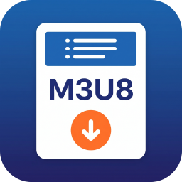

# m3u8下载器 FnM3u8

> 支持多线程、多任务、断点续传的 m3u8 视频下载器，支持 AES 解密、批量下载、直播录制。



## 功能特性

- **多线程下载** — 支持多线程并发下载，加速下载体验
- **断点续传** — 支持断点续传，任务失败后可继续下载
- **AES 解密** — 支持 AES-128/AES-256 CBC/CTR 加密的 m3u8 视频
- **批量下载** — 支持批量添加多个 m3u8 链接，排队下载
- **直播录制** — 支持直播流录制，实时录制直播内容
- **状态筛选** — 支持按状态筛选任务：全部 / 进行中 / 已完成 / 失败
- **批量操作** — 支持全暂停、全开始、删除已完成任务
- **明暗主题** — 支持浅色/深色主题切换
- **响应式布局** — 适配桌面端与移动端

## 技术架构

```
m3u8下载器 FnM3u8
├── app/ui/              # 前端界面（HTML/CSS/JS）
│   ├── index.html      # 主页面
│   ├── main.js         # 前端逻辑
│   ├── server.js       # HTTP API 服务器
│   ├── tasks.js        # 任务管理
│   ├── parser.js       # m3u8 解析器
│   ├── downloader.js   # 下载引擎
│   └── config.js       # 配置管理
├── cmd/                 # FnOS 生命周期脚本
├── config/             # 权限配置
└── wizard/             # 安装向导
```

- **后端**：Node.js ESM（零 npm 依赖，仅用内置模块）
- **前端**：原生 HTML/CSS/JS，无框架依赖
- **数据存储**：Node.js 内置 `node:sqlite`（零依赖）
- **fnOS Gateway**：自动挂载 `/app/fnm3u8` 前缀

## API 端点

| 端点 | 方法 | 描述 |
|------|------|------|
| `/api/health` | GET | 健康检查 |
| `/api/config` | GET/POST | 获取/保存配置 |
| `/api/tasks` | GET | 获取任务列表 |
| `/api/tasks` | POST | 添加下载任务 |
| `/api/tasks/:id/stop` | POST | 停止任务 |
| `/api/tasks/:id/pause` | POST | 暂停任务 |
| `/api/tasks/:id/resume` | POST | 继续任务 |
| `/api/tasks/:id` | DELETE | 删除任务 |
| `/api/parse` | POST | 解析 m3u8 URL |

## 版本历史

### v0.1.0 (2026-05-25)

- 初始版本：m3u8 视频下载
- 支持多线程/断点续传/AES 解密
- 支持批量下载/直播录制
- 状态筛选：全部/进行中/已完成/失败
- 批量操作：全暂停/全开始/删除已完成
- 浅色/深色主题切换
- 安装/升级统计上报到企业微信

## 维护者

- 作者：一起瞎折腾

---

> 如果这个项目对您有帮助，欢迎赞助支持 ❤️